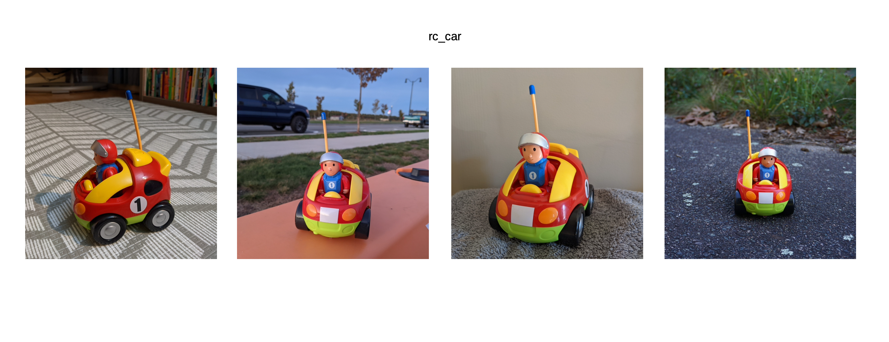
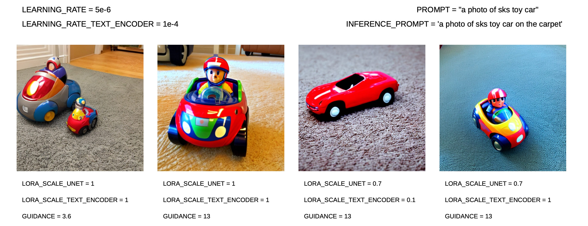
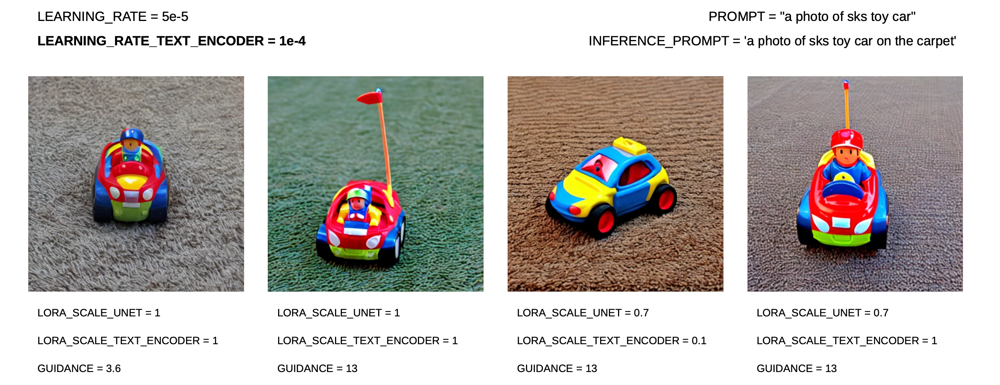
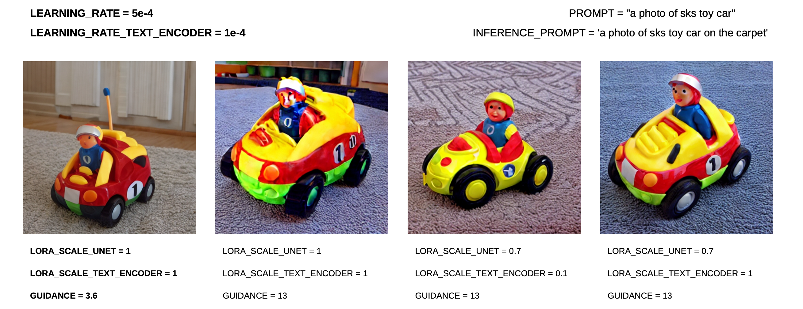
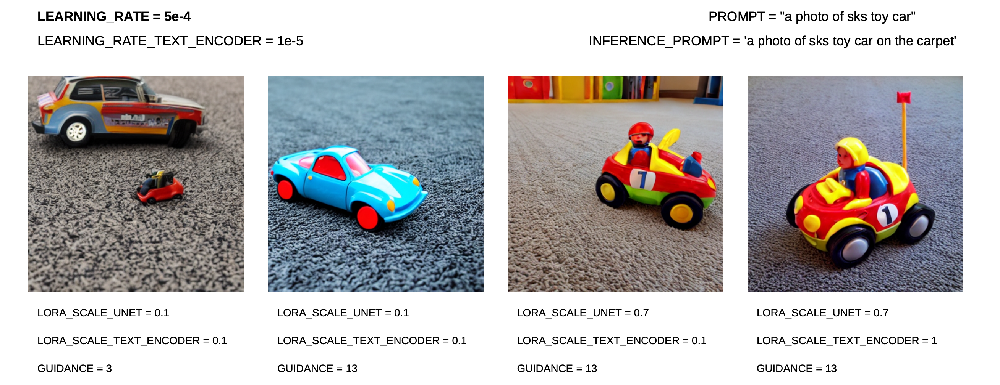

# TLab 2023. Domain-specific content generation

## Обзор статьи

- **Название статьи**: "DreamBooth: Fine Tuning Text-to-Image Diffusion Models for Subject-Driven Generation"

- **Авторы статьи**: Nataniel Ruiz, Yuanzhen Li, Varun Jampani, Yael Pritch, Michael Rubinstein, Kfir Aberman, _Google Research, 2022_

- **Текст статьи**: https://arxiv.org/abs/2208.12242

- **Страница проекта**: https://dreambooth.github.io/

- **Официальные датасеты**: https://github.com/google/dreambooth

### Тема и проблематика

**Тема статьи**: разработка новой техники для файн-тьюнинга Text-to-Image диффузионных моделей в целях повышения качества генерации изображений на основе ограниченного набора примеров (few-shot image generation).

**Проблематика**: предшествующие Text-to-Image диффузионные модели показывали слабые результаты во few-shot генерации персонализированных изображений, также им присущи такие проблемы, как переобучение и language drift.

**Актуальность**: способность к точной few-shot генерации изображений может быть очень полезна для различных приложений в компьютерном зрении — к ним относятся смена контекста, "написание" в том или ином художественном стиле, изменение ракурса, добавление различных деталей, изменение характеристик изображения.

### Идеи и результаты

**Основная идея**: представление более эффективной техники файн-тьюнинга, которая заключается в дообучении модели на 3-5 парах картинка-текст, где текст включает в себя пару [identifier][class noun]. Такой подход не меняет архитектуру модели, снижает риски переобучения, language drift и улучшает subject-driven генерацию.

**Новые идеи**: концепция использования самых редких токенов из словаря в качестве уникальных идентификаторов объектов и новая функция потерь — autogenous class-specific prior preservation loss, который отличается от стандартной L2 добавлением регуляризационного слагаемого, в котором считается L2 между текущей генерацией, и тем что сгенерировала бы не затюненная модель. Такая функция потерь призвана митигировать риски забывания моделью ее приорных знаний и снижения вариативности при генерации.

**Результаты**:

- Авторы статьи создали датасет из 30 различных классов (кошки, собаки, разные неодушевленные объекты) и сравнили на нем результаты использования техники DreamBooth на основе Imagen/Stable Diffusion и еще одной техники файн-тьюнинга Textual Inversion. Качество и достоверность (fidelity) измеряли с помощью трех метрик: DINO, CLIP-I, CLIP-T. Наилучшие результаты продемонстрировало применение DreamBooth к Imagen — в этом случае сгенерированные изображения оказались ближе всех остальных к настоящим изображениям.

- У метода DreamBooth есть ряд ограничений: сложность воспроизведения некоторых контекстов, в некоторых случаях изменение контекста может повлиять на внешний вид объекта, переобучение, разные уровни сложности генерации разных объектов — неодушевленные объекты могут поддаваться генерации лучше, чем одушевленные.


## Запуск решения и дообучение весов под выбранный домен

### Setup

- Создать новую директорию, в которой будет лежать файл ```LORA_Colab.ipynb``` и папка ```data```, в которой будут лежать все необходимые наборы изображений: либо фотографии самого объекта, либо фотографии класса, к которому объект относится.
- В секции Training присвоить переменной ```IMAGES_FOLDER_OPTIONAL``` значение, соответствующее пути до директории, в которой лежат фотографии объекта.
- В секции Training присвоить переменной ```PROMPT``` значение, соответствующее текстовому описанию объекта (например, ```a photo of sks dog```).
- Если при обучении будет выставлен флаг ```--with_prior_preservation``` то в секции Training необходимо присвоить переменной ```CLASS_DIR``` значение, соответствующее пути до директории, в которой лежат фотографии класса.
- Если при обучении будет выставлен флаг ```--with_prior_preservation``` то в секции Training необходимо присвоить переменной ```CLASS_PROMPT``` значение, соответствующее текстовому описанию фотографии с объектами-представителями класса (например, ```a photo of a dog```).
- Запустить все ячейки ноутбука ```LORA_Colab.ipynb```.
- В секции Inference присвоить переменной ```INFERENCE_PROMPT``` значение, соответствующее текстовому описанию изображения, которое вы хотите получить (например, ```a photo of sks dog on the grass```).

### Подготовка к экспериментам

- Было решено запускать ноутбук локально на компьютере, чтобы не быть жертвой ограничений от Google Colab. Все описанные далее эксперименты были поставлены с использованием GPU GeForce RTX 3090 Ti 24 GB.
- Я проводила эксперименты на трех разных наборах данных: ```dog```, ```rc_car```, ```nina```. Первые два датасета я скачала со страницы DreamBooth на GitHub (ссылка есть в начале обзора статьи). Третий датасет я подготовила сама: были выбраны 20 изображений, на которых мое лицо изображено вблизи, как на паспорте. Далее я немного обработала этот набор данных: обрезала картинки до размера 512х512 так, чтобы лицо оставалось по центру фотографии. Приведу подробное описание экспериментов с датасетом ```rc_car```.
- Есть незначительные изменения в коде: до секции Training я прописала все команды, которые при выполнении ячеек ноутбука сами исправят устаревший код в файлах ```train_lora_dreambooth.py```, ```xformers_utils.py``` и решат проблему того, что локально не сразу срабатывает команда ```pip install lora```.
- Среди флагов, которые надо выставить при обучении, не хватало ```--seed```, ```--with_prior_reservation```, ```--class_data_dir```, ```--class_prompt```. Соответственно, они были добавлены.

### Эксперименты

Датасет: ```rc_car```

**Training**

- ```LEARNING_RATE=5e-4```

В оригинальной статье при проведении экспериментов на основе Stable Diffusion было выставлено значение ```LEARNING_RATE=5e-6```, поэтому мне показалось разумным начать с него. Однако результаты были неудовлетворительны, поэтому я стала постепенно увеличивать значение. См. рис. 2-4

- ```LEARNING_RATE_TEXT_ENCODER=1e-4```

Я попробовала значение меньше, но в этом случае результаты хуже. См. рис. 5.

- ```STEPS=300``` — выставила небольшое значение для тестирования гипотез о значениях гиперпараметров.

Более ранние гипотезы с другими датасетами я тестировала при ```STEPS=1000```, как в оригинальной статье, а также при ```STEPS=10000```, но результат не становился принципиально лучше.
  
- ```--train_batch_size=1```

При ```--train_batch_size=1```: обучение длилось ~1.5 минуты, ```--train_batch_size=8```: обучение длилось ~3.5 минуты.  Я не увидела прироста качества генерации при удачных гиперпараметрах на инференсе, поэтому оставляем ```--train_batch_size=1```.

Ниже на рис. 1 представлены несколько иозбражений из датасета ```rc_car```. 

Рисунок 1:


Рисунок 2:


Рисунок 3:


Рисунок 4:


Рисунок 5:


Судя по рис. 4, надо оставить ```LEARNING_RATE_TEXT_ENCODER=1e-4```.

**Inference**

Я варьировала следующие параметры: ```LORA_SCALE_UNET```, ```LORA_SCALE_TEXT_ENCODER```, ```GUIDANCE```. Результаты можно увидеть на рис. 2-5.

Продолжение следует...
